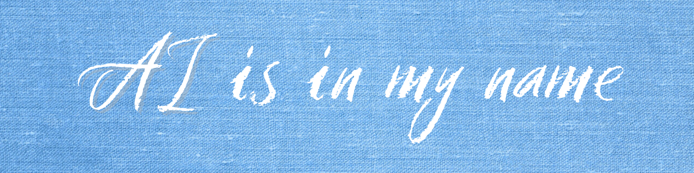

  

 

<table width="100%" align="center">
<tr>
<td width="60%" align="left">
  
<h1>Hi, I'm Aniket Chaudhary 👋</h1>

  
<i>An engineer who gets serious when he's funny, and vice-versa.</i>  

- 🔭 **Working on:** Creating my own LLM from scratch
- 🌱 **Learning:** Advanced LLM architectures & System Design
- 👯 **Collaborating on:** Innovative AI applications
- 💬 **Ask me about:** Solutions that bring real ROI
 

</td>
<td width="40%" align="center">
  
</td>
</tr>
</table>

---

## 💻 Tech Stack

  

 

  
  
  
  
  
  

---

## 📈 Analytics & Activity

  
  

 

  

 

  

